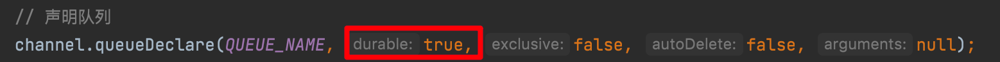
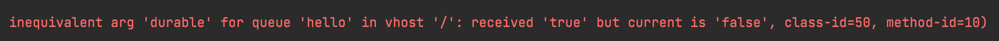
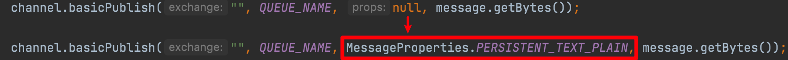

**为什么需要这个机制**:
默认情况下 RabbitMQ 退出或由于某种原因崩溃时，它会清空队列和消息，除非告知它不要这样做,为了保障当 RabbitMQ 服务停掉以后消息生产者发送过来的消息不丢失，需要做两件事：**将队列和消息都标记为持久化**。

## 队列持久化
之前我们创建的队列都是非持久化的，RabbitMQ 如果重启，该队列就会被删除掉，如果要队列实现持久化就需要在声明队列的时候把 durable 参数设置为 true

## 消息持久化
要想让消息实现持久化需要在消息生产者修改代码，添加MessageProperties.PERSISTENT_TEXT_PLAIN 属性

将消息标记为持久化并不能完全保证不会丢失消息。尽管它告诉 RabbitMQ 将消息保存到磁盘，但是这里依然存在当消息刚准备存储在磁盘的时候 但是还没有存储完，消息还在缓存的一个间隔点。此时并没有真正写入磁盘。持久性保证并不强，但是对于我们的简单任务队列而言，这已经绰绰有余了。**如果需要更强有力的持久化策略，需要发布确认机制进行消息确认和消息回退**
