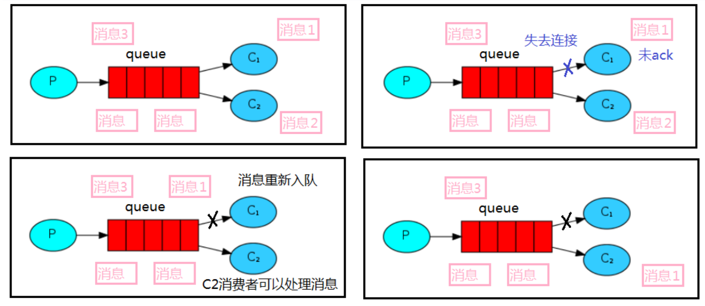

**为什么需要这个机制**:
默认情况下，RabbitMQ 一旦向消费者发送了一条消息后，便立即将该消息标记为删除。由于消费者处理一个消息可能需要一段时间，假如在处理消息中途消费者挂掉了则会导致这些消息丢失

**消息应答（解决方式）：**

为了保证消息在发送过程中不丢失，RabbitMQ 引入消息应答机制，消息应答意思就是：消费者在接收消息并且处理完该消息之后，才告知 RabbitMQ 可以把该消息删除了（手动应答）。

RabbitMQ 中消息应答方式有两种：自动应答（默认）、手动应答

## 自动应答(默认)
自动应答即消息发送后立即被认为已经传送成功，也就是RabbitMQ默认采用的消息应答方式。这种模式需要在高吞吐量和数据传输安全性方面做权衡，因为该模式下如果消息在被接收之前，消费者的 connection 或者 channel 关闭，消息就丢失了。此外，由于消费者没有对传递的消息数量进行限制，发送方可以传递过载的消息，可能会造成消费者这边由于接收太多消息来不及处理，导致这些消息的积压，使得内存耗尽，最终使得这些消费者线程被操作系统杀死。

所以这种模式仅适用在消费者可以高效并以某种速率能够处理这些消息的情况下使用。

## 手动应答
采用手动应答后的消息自动重新入队可以避免自动应答中消息丢失的情况。如果消费者由于某些原因失去连接(其通道已关闭，连接已关闭或 TCP 连接丢失)，导致**消费者未发送 ACK 确认给服务端**，RabbitMQ 服务端（Broker）了解到消息未完全处理，并将**对消息重新入队**。如果此时其他消费者可以处理，它将很快将其重新分发给另一个消费者。这样，即使某个消费者偶尔死亡，也可以确保不会丢失任何消息。

