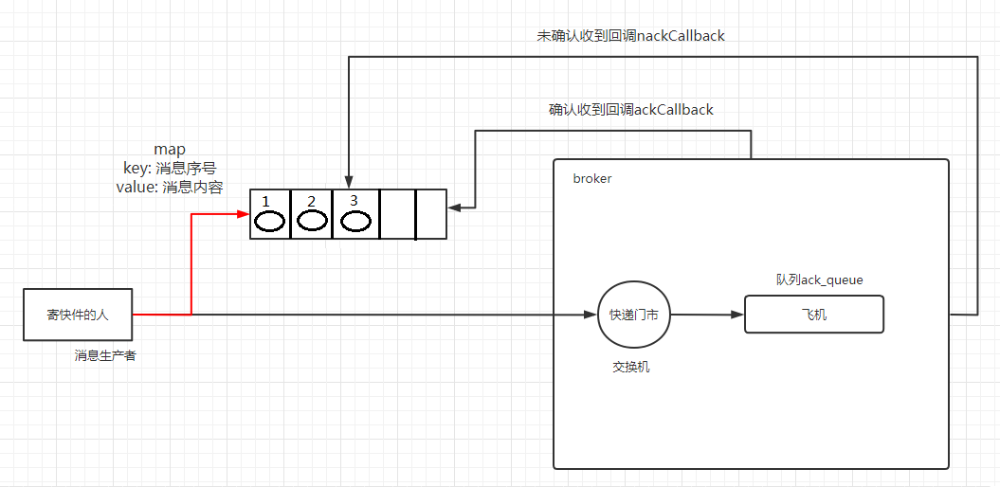

**为什么需要这个机制**:
生产者发送消息时，可能因网络故障、RabbitMQ 节点崩溃等原因，导致消息实际未到达 Broker但生产者也不知情，这时候就需要发布确认，RabbitMQ 收到消息并持久化（如果需要）后，会向生产者发送一个 确认（ACK）信号。生产者通过接收 ACK 可以明确知道消息已被 Broker 成功接收。

## 原理:
发布确认默认是没有开启的，如果要开启需要调用方法 confirmSelect，每当你要想使用发布确认，都需要在 channel 上调用该方法

生产者将信道设置成 confirm 模式，一旦信道进入 confirm 模式，所有在该信道上面发布的消息都将会被指派一个唯一的 ID(从 1 开始)，一旦消息被投递到所有匹配的队列之后，broker 就会发送一个确认给生产者(包含消息的唯一ID)，这就使得生产者知道消息已经正确到达目的队列了
如果消息和队列是可持久化的，那么确认消息会在将消息写入磁盘之后发出

-------------
**发布确认模式**最大的好处在于他可以是异步的，一旦发布一条消息，生产者在等RabbitMQ返回确认的同时可以继续发送下一条消息。
- 消息发送成功：当消息最终得到确认之后，生产者便可以通过回调方法来处理该确认消息
- 消息发送失败：如果 RabbitMQ 因为自身内部错误导致消息丢失，就会发送一条 nack 消息，生产者同样可以在回调方法中处理该 nack 消息（进行重新发布等等）。

## 发布确认三种策略
`单个确认发布`、`批量确认发布`、`异步确认发布`。其中前两者是同步确认的方式，也就是发布一个/一批消息之后只有被确认发布，后续的消息才能继续发布，后者是异步确认的方式，我们只管发布消息即可，消息是否被确认可以通过回调函数来接收到。

--------------
**异步确认（推荐）**
异步确认虽然编程逻辑比上两个要复杂，但是性价比最高，无论是可靠性还是效率都没得说，他是利用回调函数来达到消息可靠性传递的，这个中间件也是通过函数回调来保证是否投递成功，

