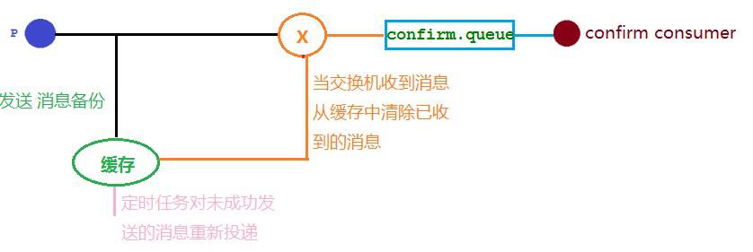
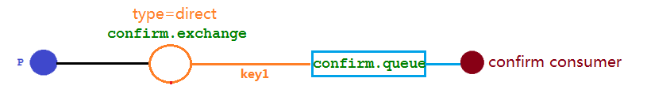

## 防止消息投递失败，确保RabbitMQ的消息可靠投递
在发布确认时生产者会通过缓存来对消息进行备份，比如当生产者发送消息到交换机时，但交换机不存在，我们应该将消息放入缓存中；或者交换机存在，队列不存在了，当交换机发送不到队列中也应该将消息放入缓存。然后在缓存中配置一个定时任务，对没有发送成功的消息重新进行投递。这样就避免了消息丢失的情况。

## 详细解释发布确认中的回调函数使用

`架构图如下所示`：我们要解决问题就是如果图中的交换机或者队列出现问题，应该将消息进行缓存处理，防止消息丢失，具体的实现就是通过生产者的回调接口`ConfirmCallback`来实现

### **情形:**
**1.（消息确认）成功发送**
消息成功发送到交换机并触发了回调函数将确认内容返回给生产者

**2.（消息确认）找不到的交换机**
消息发送失败并触发了回调函数将内容返回给生产者（进行再次投递或者类似操作）

**3.（消息回退）送的消息都成功被交换机接收，也收到了交换机的确认回调，但消费者并没有接收到消息**由于目标队列不存在导致该消息的 RoutingKey 与队列的 BindingKey 不一致，也没有其它队列能接收这个消息，所以该消息被直接丢弃了，由于交换机返回了确认回调，所以此时生产者是不知道消息被丢弃这个事件。

**解决：**
我们可以通过设置 mandatory 参数可以在当消息传递过程中不可达目的地时将消息返回给生产者。
在配置文件当中需要添加配置表示开启消息路由失败后会触发消息回退回调方法
新增实现 RabbitTemplate.ReturnsCallback 接口

**结果**
最终发送消息指定错误的routing-key时**消息回退的回调函数**成功被触发生产者收到消息，回退消息的错误原因是路由key出错。

