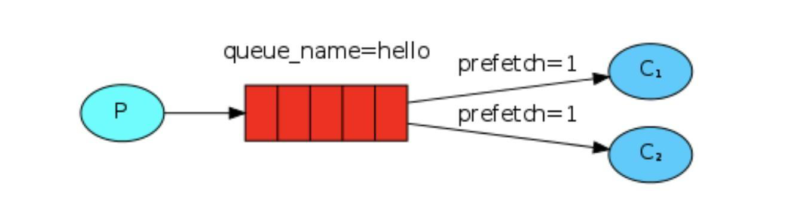

**为什么需要这个机制**:
RabbitMQ 默认分发消息采用的轮询分发模式，但是在某种场景下这种策略并不是很好，比方说有两个消费者在处理任务，其中 consumer01 处理任务的速度非常快，而 consumer02 处理速度却很慢，此时如果我们还是采用轮训分发的化就会使处理速度快的 consumer01 很大一部分时间处于空闲状态，而 consumer02 一直在干活，这种分配方式在这种情况下其实就不太好，但是 RabbitMQ 并不知道这种情况它依然很公平的进行分发。

**为了避免这种情况**，我们可以设置参数 channel.basicQos(1)，意思就是每个消费者只能处理完当前消息才能接受新的消息。

**设置之后示意图**：
可以理解如果当前消息我没有处理完的话或者还没有应答的话，新的消息就先别分配给我，我目前只能处理一个消息，然后 RabbitMQ 就会把该任务分配给没有那么忙的那个空闲消费者，当然如果所有的消费者都没有完成手上任务
