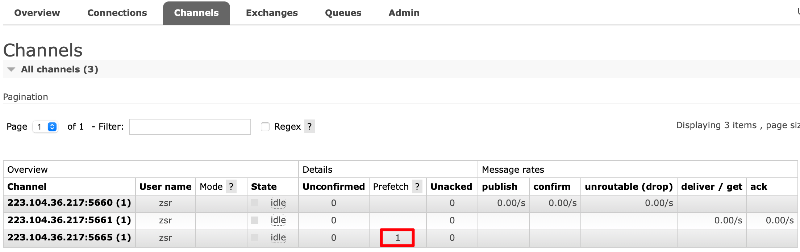
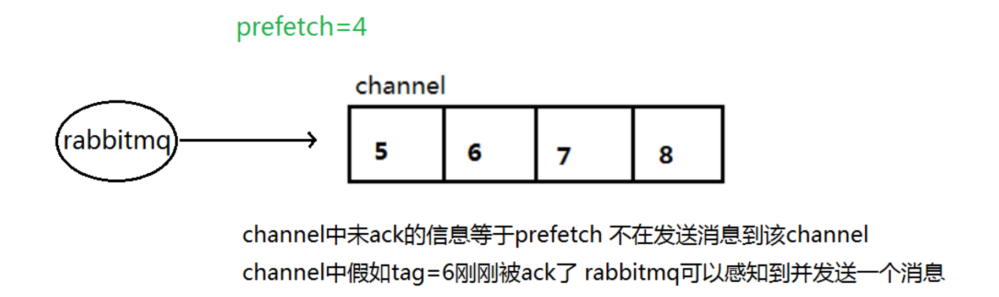

**为什么需要这个机制（针对手动应答）**:
本身消息的发送是异步的,消费者消费消息时channel 上肯定不止只有一个消息，消费者消费消息之后手动应答模式下本质上也是异步的，**因此就存在一个未确认的消息缓冲区，通过给通道上`允许存在的未确认消息数量`进行预取值，以避免缓冲区里面无限制的未确认消息问题**


## 原理：
通过使用 `basic.qos `方法设置“预取计数”值来完成。该值定义`通道上允许的未确认消息的最大数量`。一旦数量达到配置的数量，RabbitMQ 将停止在通道上传递更多消息，当有新的未处理的消息被确认时，RabbitMQ 将会允许继续向通道内发送消息



## 注意
消息应答和 QoS 预取值对用户吞吐量有重大影响。通常增加预取将提高向消费者传递消息的速度，虽然自动应答传输消息速率是最佳的，但是在这种情况下已传递但尚未处理的消息的数量也会增加，从而增加了消费者的内存消耗。我们应该小心使用具有无限预处理的自动确认模式或采用手动确认模式，
### 手动应答（Manual-Ack） vs 自动应答（Auto-Ack）对比

| **对比维度**     | **手动应答（Manual-Ack）**                                         | **自动应答（Auto-Ack）**                                      |
| ---------------- | ------------------------------------------------------------------ | ------------------------------------------------------------- |
| **确认机制**     | 需显式调用`basic_ack`确认消息，RabbitMQ收到ACK后才删除消息         | 消息发出后立即自动确认，无需消费者干预                        |
| **消息可靠性**   | 高（未确认消息会重新入队，避免丢失）                               | 低（消费者崩溃时，已推送但未处理的消息会丢失）                |
| **吞吐量**       | 较低（需等待ACK网络往返）                                          | 高（无确认延迟，持续快速推送）                                |
| **内存消耗主体** | RabbitMQ服务端（消息保留在队列中直到被确认）                       | 消费者客户端（消息积压在内存缓冲区）                          |
| **背压控制**     | 天然支持（通过ACK速率限制消息流）                                  | 无控制（可能压垮消费者内存）                                  |
| **适用场景**     | 关键业务（如支付、订单）                                           | 非关键数据（如日志、监控）                                    |
| **代码示例**     | ```python<br>ch.basic_ack(delivery_tag=method.delivery_tag)<br>``` | ```python<br>channel.basic_consume(..., auto_ack=True)<br>``` |
| **重新投递**     | 支持（未ACK/NACK的消息可重新入队）                                 | 不支持（消息一旦发出即删除）                                  |
| **Prefetch控制** | 可通过`basic_qos`限制未确认消息数（如prefetch_count=1）            | 无效（自动确认机制下prefetch无意义）                          |
| **网络影响**     | 增加ACK确认的少量网络开销                                          | 无额外网络开销                                                |