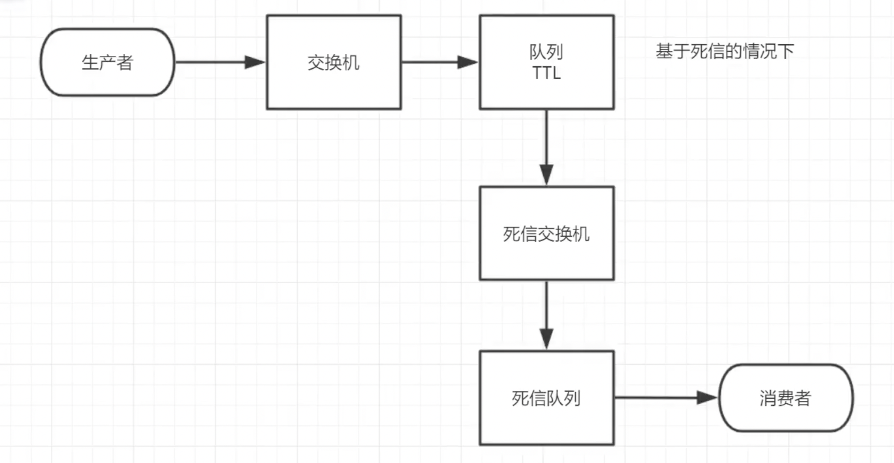
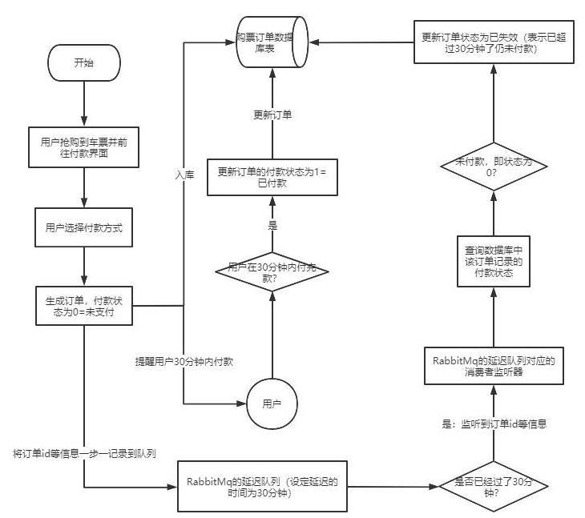
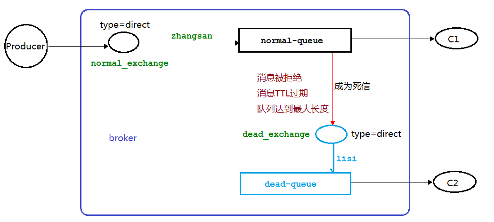
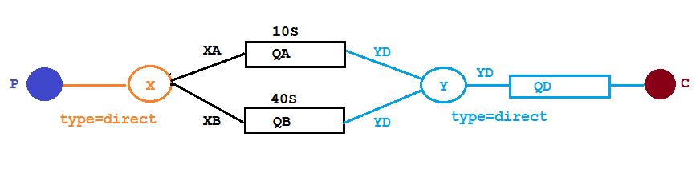

## **为什么需要这两个机制**:
但对于数据量比较大，并且时效性较强的定时场景，如：“订单十分钟内未支付则关闭“，短期内未支付的订单数据可能会有很多，活动期间甚至会达到百万甚至千万级别，对这么庞大的数据量仍旧使用轮询的方式检查显然是不可取的，很可能在一秒内无法完成所有订单的检查，同时会给数据库带来很大压力，无法满足业务要求而且性能低下。

这时我们往往需要这两个机制来完成某些定时执行的任务

**使用场景**：
订单在十分钟之内未支付则自动取消。
新创建的店铺，如果在十天内都没有上传过商品，则自动发送消息提醒。
用户注册成功后，如果三天内没有登陆则进行短信提醒。
用户发起退款，如果三天内没有得到处理则通知相关运营人员。
预定会议后，需要在预定的时间点前十分钟通知各个与会人员参加会议

### **场景详解**：用户抢到车票并停留在付款页面
通过`延时队列`设置订单消息延时时间为30分分钟，当到达30分钟之后消息会被丢到`死信队列`，消费者消费处理死信队列中的订单消息-判断是否付款（付款则更新订单状态，没有付款则关闭订单）

  -------
## 死信队列
**概念**：
死信就是无法被消费的消息。一般来说，producer 将消息投递到 broker 或者直接到 queue 中，consumer 从 queue 取出消息进行消费，但某些时候由于特定的原因导致 queue 中的某些消息无法被消费，这样的消息如果没有后续的处理，就变成了死信，有死信自然就有了死信队列。

**死信的原因：**
消息 TTL 过期
队列达到最大长度（队列满了无法再添加数据到 mq 中）
消息被拒绝(basic.reject 或 basic.nack)并且 requeue=false

## 延时队列

**概念**：
延时队列是指消息进入队列后不会立即被消费，而是在指定的时间后才能被消费的队列。RabbitMQ本身没有直接提供延时队列功能，但可以通过TTL（Time To Live）配合死信队列来实现延时队列的效果。

### RabbitMQ 中的 TTL
TTL 是 RabbitMQ 中一个消息或者队列的属性，表明一条消息或者该队列中的所有消息的最大存活时间，单位是毫秒。如果一条消息设置了 TTL 那么这条消息如果在TTL 设置的时间内没有被消费，则会成为"死信"。如果同时配置了队列的TTL 和消息的TTL，那么较小的那个值将会被使用，有两种方式设置 TTL：

**1.针对每条消息设置TTL（生产者设置）**
**2.为队列设置TTL（MQ创建队列时设置，作用于放入该队列中的每一条消息）**

**延时队列实现原理**：
通过将普通队列设置TTL，当消息过期后不直接删除，而是路由到死信队列。消费者监听死信队列来实现延时消费的效果。这样就实现了消息的延时处理功能。

| **TTL 类型** | **触发时机**                                    | **过期后的行为**                                           | **适用场景**                         |
| ------------ | ----------------------------------------------- | ---------------------------------------------------------- | ------------------------------------ |
| **队列 TTL** | 消息进入队列时开始计时                          | 到期后立即删除（或进入死信队列）                           | 需要严格控制队列中所有消息的存活时间 |
| **消息 TTL** | 消息进入队列时开始计时，消息即将被投递时检查TTL | 消息即将出队列时检查是否过期，过期则删除（或进入死信队列） | 允许消息在队列中存留更长时间         |

------------
## 死信队列+延时队列实例：

其中有两个direct类型的交换机X、Y，其中Y为死信交换机；还有三个队列QA、QB、QD，QA和QB为普通队列，其中QA中消息的ttl为10s，QB中消息的ttl为40s，QD为死信队列。队列与交换机之间的routing-key如图中连线上标注所示

**结果**：生产者为两个队列各发一条消息"hello",10秒之后消费者C从死信队列消费并打印QA队列的消息，40秒之后消费者C从死信队列消费并打印QB队列的消息

