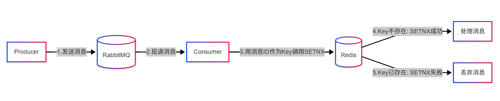

## **为什么需要这个机制**:
幂等性：**指用户对于同一操作发起的一次请求或者多次请求的结果是一致的，用户不会因为多次点击而产生了其它结果**。

**场景：**比如用户购买商品后支付后已经扣款成功，但是返回结果时出现网络异常，用户并不知道自己已经付费成功，于是再次点击按钮，此时就进行了第二次扣款，这次的返回结果成功。但是扣了两次用户的钱，这就出现了不满足幂等性，即用户对统一操作发起了一次或多次请求不一致，产生了副作用导致用户被多扣费了。

**原理：**
消费者在消费 MQ 中的消息时，MQ 已把消息发送给消费者，消费者在给 MQ 返回 ack 时网络中断，故 MQ 未收到确认信息，该条消息会重新发给其他的消费者，或者在网络重连后再次发送给该消费者，但实际上该消费者已成功消费了该条消息，造成消费者的重复消费。

---------
## 实现幂等性
幂等性的实现一般使用全局ID，就是每次完成一次操作应该生成一个唯一标识，比如时间戳、UUID、消息队列中消息的id号等等。这样每次消费消息时都先通过该唯一标识先判断该消息是否已消费过，如果消费过则不再消费，则避免了消息重复消费问题。

## 结合Redis的原子性操作来实现：
利用 redis 执行 setnx（SET if Not eXists） 命令，天然具有幂等性，从而实现不重复消费
**流程**：在消费者开始处理消息时，立即通过 SETNX 将消息的唯一标识（Key）存入 Redis，
如果Key已经存在则丢弃消息，如果不存在则处理消息，处理成功之后将Key从Redis中删除。

