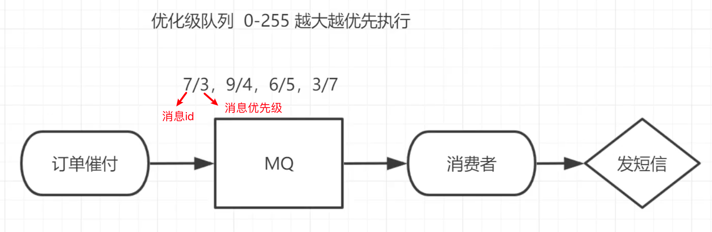

## **为什么需要这个机制**:
用户在淘宝下单后，往往会及时将订单信息推送给用户，如果用户在设定的时间内未付款那么就会给用户推送一条短信提醒，这个功能看似很简单，但是当订单量十分大的情况下，商家往往要进行优先级排序，大客户先推送，小客户后推送的

**因此我们需要给以给要发送的消息设置优先级，满足不同场景的需要。**

--------------------
具体实现请网上查询（可以通过本文参考的网址）

**注意**：队列需要设置为优先级队列的同时消息也必须设置消息的优先级才能生效，而且消费者需要等待消息全部发送到队列中才去消费因为这样才有机会对消息进行排序