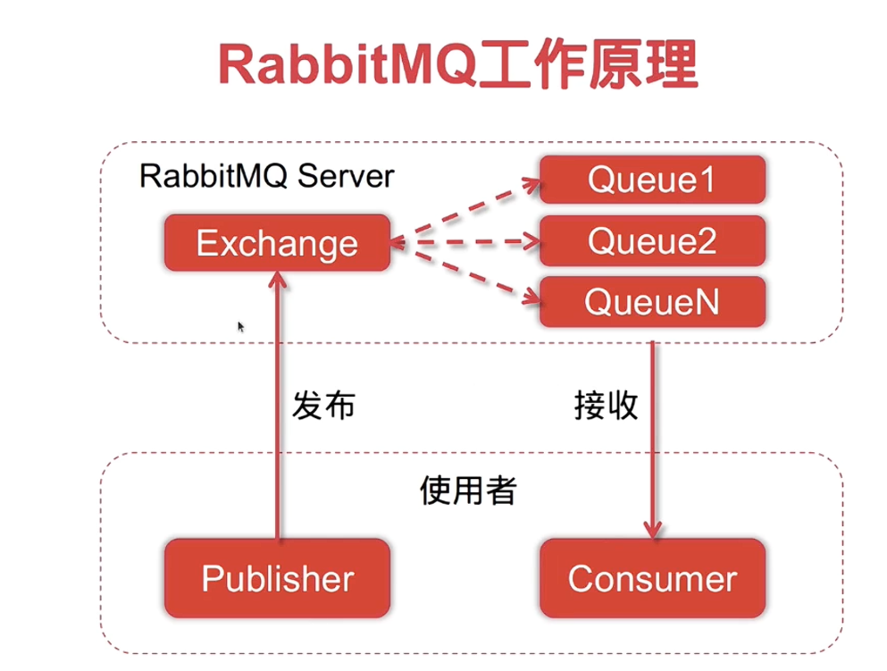
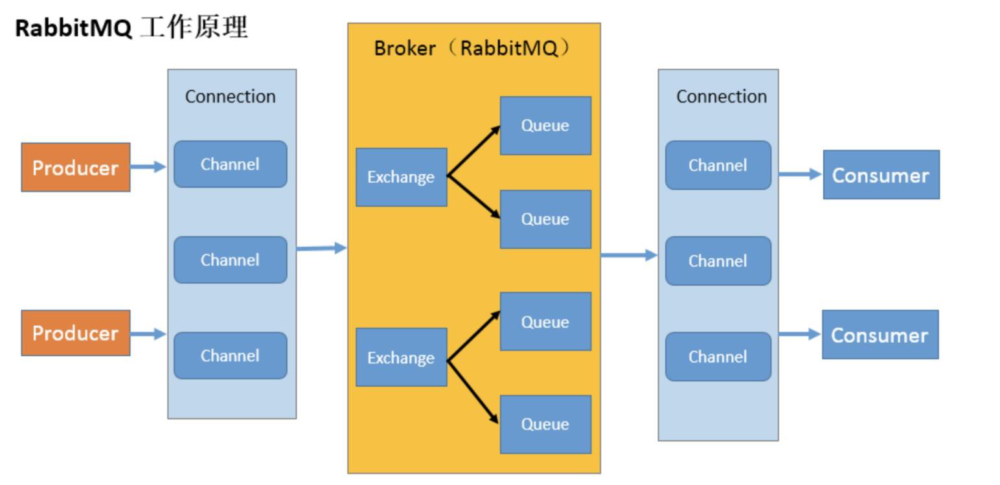
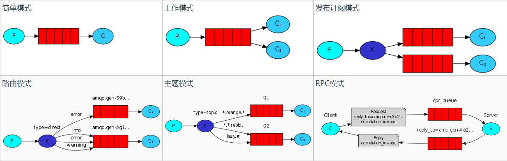
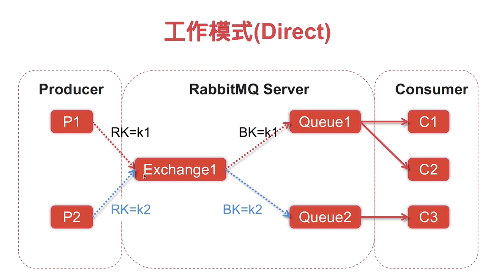
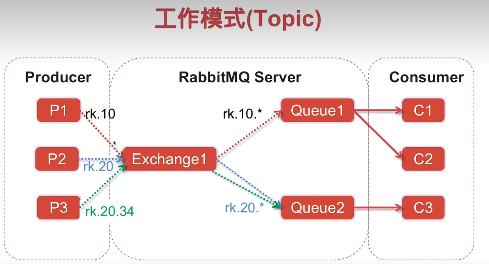

## RabbitMQ原理：

### RabbitMQ关键术语

1. **Exchange（交换机）**：
    - 用于接收生产者发送的消息并根据绑定规则将消息路由到队列。
    - 常见交换机类型：
      - `direct`：类似单播，根据路由键精确匹配队列。
      - `fanout`：类似广播，将消息广播到所有绑定的队列。
      - `topic`：类似组播，根据路由键模式匹配队列。
      - `headers`：根据消息头属性匹配队列，请求头与消息头匹配才能接收消息
  
2. **Queue（队列）**：
    - 用于存储消息的缓冲区，消费者从队列中获取消息进行处理。

3. **Routing Key（路由键）**：
    - 消息的路由规则，生产者发送消息时指定，交换机根据路由键将消息分发到对应的队列。

4. **Binding（绑定）**：
    - 连接交换机和队列的关系，定义了路由键或匹配规则。

5. **Producer（生产者）**：
    - 负责发送消息到交换机的应用程序。

6. **Consumer（消费者）**：
    - 从队列中接收并处理消息的应用程序。

7. **Channel（信道）**：
    - RabbitMQ 中的通信通道，生产者和消费者通过信道与 RabbitMQ 服务器交互。

8. **Connection（连接）**：
    - 应用程序与 RabbitMQ 服务器之间的 TCP 连接。

9. **Message（消息）**：
    - 由生产者发送到队列并由消费者处理的数据单元。

10. **Ack（确认）**：
     - 消费者处理消息后向 RabbitMQ 发送的确认信号，确保消息不会丢失。

11. **AMQP（高级消息队列协议）**：
     - RabbitMQ 使用的消息传递协议，提供消息的可靠传输和路由功能。
一种开源的消息代理、面向消息的中间件、遵循AMQP协议的MQ服务，逻辑解耦来解决异步任务。

 ### 工作模式
    ⭐注意：工作模式是设计概念，交换机类型是实现工作模式的具体机制

RabbitMQ提供6种模式，分别是 `Hello World`、`Work Queues`、`Publish/Subscribe`、`Routing`、`Topics`、`RPC`。本文详细讲述了前5种，并给出代码实现和思路。**其中 Publish/Subscribe、Routing、Topics 三种模式可以统一归为 Exchange 模式，只是创建时交换机的类型不一样，分别是 fanout、direct、topic 三种交换机类型。**
**注意**：简单模式和工作模式虽然途中没有画出交换机，但是都会有一个默认的交换机，类型为`direct`

### **最常用的三种消息模式：`Publish/Subscribe`、`Routing`和`Topics`**
`Publish/Subscribe`：
通常通过交换机`Fanout类型实现`

 这种类型非常简单，它是将接收到的所有消息广播到它知道的所有队列中。RabbitMQ 系统中默认有一个 fanout 类型的交换机。
**Routing：**
通常通过`direct类型`交换机实现
- **说明**：一个生产者，一个 direct 类型的交换机，多个队列，交换机与队列之间通过 routing-key 进行关联绑定，多个消费者。生产者发送消息到交换机并且要指定routing-key，然后消息根据这交换机与队列之间的 routing-key 绑定规则进行路由被指定消费者消费。

- **工作原理**：RK=k1的消息通过交换机投递到BK=k1的队列中队列中的消息再由提前与该队列绑定的消费者进行消费。，k2同理。

**Topic：**
通常通过交换机`topic类型实现`
- **说明**：一个生产者，一个 topic 类型的交换机，多个队列，交换机与队列之间通过 routing-key 进行关联绑定，多个消费者。生产者发送消息到交换机并且要指定 routing-key，然后消息根据这交换机与队列之间的 routing-key 绑定规则进行路由被指定消费者消费。与路由模式不同是 routing-key 有指定的队则，可以更加的通用，满足更复杂的场景。
- **routing-key 的规则**：
- routing_key 不能随意写，必须满足一定的要求，它必须是一个单词列表，以点号分隔开。这些单词可以是任意单词，比如说：“stock.usd.nyse”、“nyse.vmw”、“quick.orange.rabbit” 这种类型的
  `#`：匹配一个或者多个词（多个字母组成），例如lazy.# 可以匹配 lazy.xxx 或者 lazy.xxx.xxx
  `*`：只能匹配一个词（多个字母组成），例如lazy.* 只能匹配 lazy.xxx

- **工作原理**：为每个队列设置一个通配符，通配符为rk.10的消息通通通过交换机路由到队列1，通配符为rk.20开头的队列统统路由到队列2

------------------------------

## 完整过程

安装好rabbitMQ，在上面创建好交换机`Exchange`和队列`Queue`，将队列与交换机进行绑定，并创建队列的`Rountkey`.

发布者发布消息时交换机会根据消息携带的`Rountkey`转发到对应的队列中

